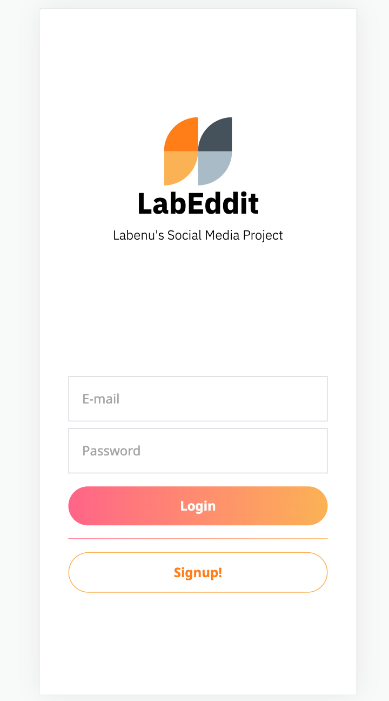
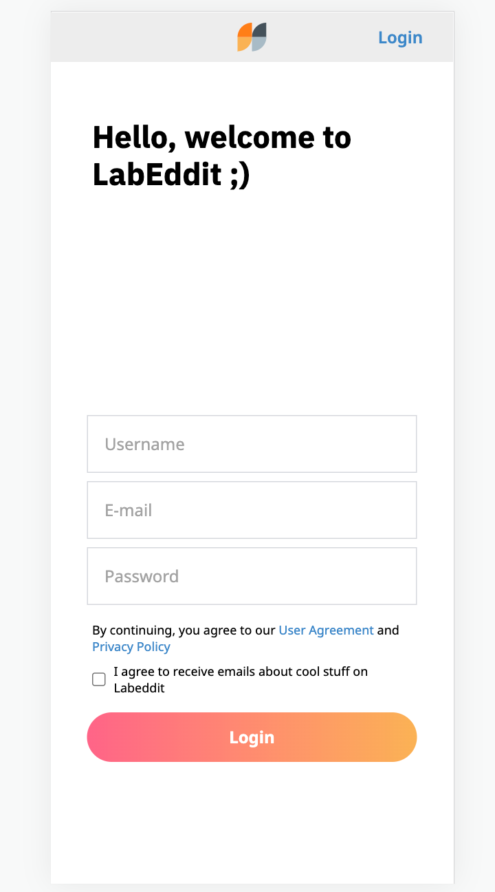
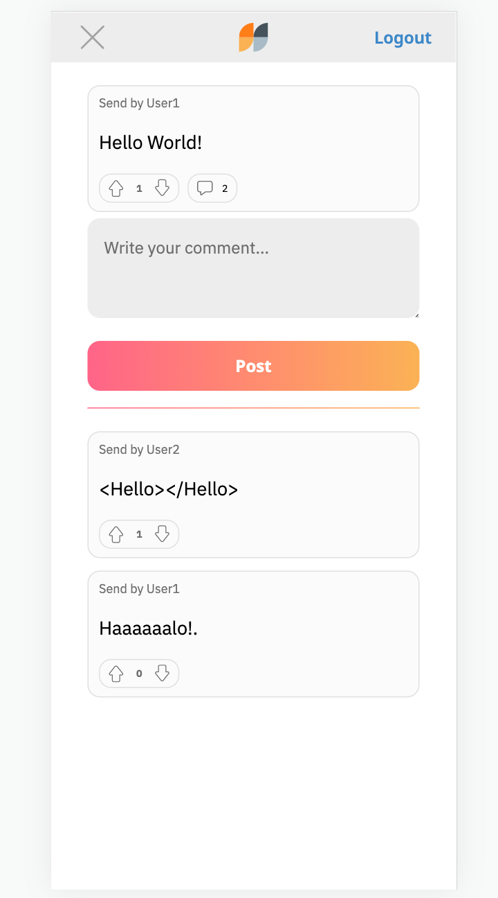

## 

🚩 [Projeto Labeddit - Backend](https://github.com/Orcisantos76/labe-front)

## Funcionalidades do projeto

- Login Page
- Signup Page
- Feed Page
- Post's comments Page


## Link Labeddit Surg

https://labedditorcifaruqi.surge.sh

## Layout

<div class="fex">




</div>

Este projeto foi construído a partir do zero, incluindo a criação das páginas de Login, Cadastro, Feed e Comentários de Posts. Além disso, para alimentar a plataforma, desenvolvemos nossa própria API personalizada, exclusivamente para este projeto.

## Comandos de instalação do projeto

```bash
# Clone this repository
$ git clone linkrepo

# Acesse the folder in you terminal
$ cd labeddit-fullstack-project-frontend

# Install dependêncies
$ npm install

# Execute the application
$ npm run dev
```

## Tecnologias abordadas

1. [React](https://pt-br.reactjs.org/)
2. [React Router](https://reactrouter.com/en/main)
3. [Tailwind](https://tailwindcss.com/)
4. [Global Context](https://pt-br.reactjs.org/docs/context.html)
5. [Axios](https://axios-http.com/docs/intro)

